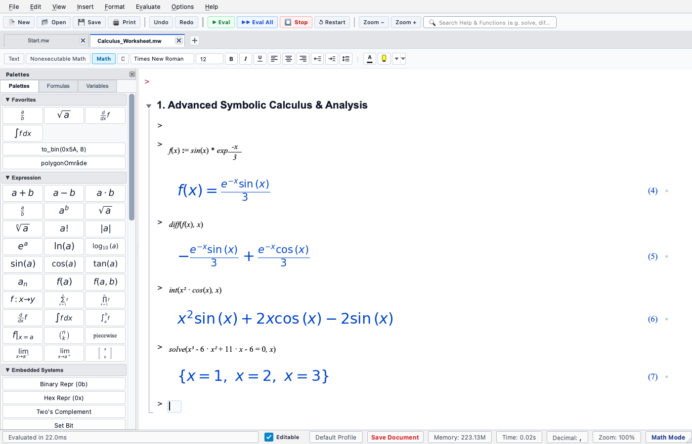
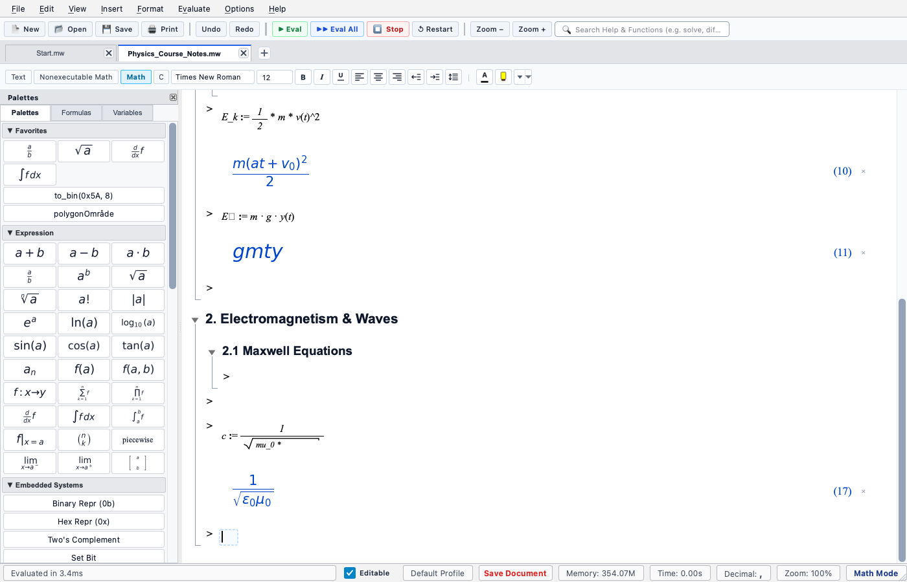

# OpenMath

An open-source interactive computer algebra system (CAS) focusing on symbolic computation, typeset mathematical rendering, and an interactive worksheet document experience.

**Developed by [J2KJonas](https://github.com/J2KJonas) and [elomarjc](https://github.com/elomarjc)**

[](https://j2kjonas.github.io/OpenMath/)


---

## 📸 Application Showcase

<div align="center">
  
  
</div>

<div align="center" style="margin-top: 10px;">
  
  
</div>

---

## 🚀 Quick Start

### 🌐 Run in Browser (Web Demo — No Install Needed)

> [!NOTE]
> **Lightweight Web Demo**: The browser version is intended solely as a quick, zero-install preview. For actual workflows and full functionality, **the native desktop application is far superior and strongly recommended**—it features the complete Python/SymPy CAS engine, native PyQt6 interface, high-fidelity vector PDF exports, interactive tables, full plotting capabilities, and offline local file management.

OpenMath is accessible instantly online as a demo via GitHub Pages:
👉 **[Launch OpenMath WebApp](https://j2kjonas.github.io/OpenMath/)**

---

### 💻 Run Desktop Application (Recommended — Full Power)

#### 🍎 macOS
- **One-Click Launch**: Double-click **`OpenMath.command`** in Finder.
- **Or via Terminal**:
  ```bash
  ./run.sh
  ```

#### 🐧 Linux (Ubuntu, Debian, Fedora, Arch, Zorin OS)
```bash
./run.sh
```
*(Automatically creates an isolated `.venv` and installs prerequisites).*

#### 🪟 Windows
- Double-click **`run.bat`**, or run:
  ```cmd
  python main.py
  ```

*(Optional shortcuts for Desktop and Application Menu can be generated from the `scripts/` directory).*

---

## ✨ Features

- **Interactive Worksheet Environment**:
  - Chronological execution blocks with crisp LaTeX formula rendering.
  - Multi-level hierarchical section folding (`1. Section`, `1.1 Subsection`) with continuous visual scope brackets (`└───`) and collapsible toggles (`▼` / `▶`).
  - Custom $M \times N$ interactive tables with resize handles and theme adaptation.
  - Per-cell precision configuration (2 to 50 digits) with instant exact $\leftrightarrow$ numeric toggling.

- **Comprehensive Computer Algebra System (CAS)**:
  - **Calculus**: Symbolic and numerical integration ($\int, \int_a^b$), differentiation ($d/dx$), limits ($\lim$), Taylor/Laurent series, and ODE solvers (`dsolve`).
  - **Linear Algebra**: Matrix calculations (determinant, inverse, eigenvalues/eigenvectors, RREF, rank) with an interactive visual **Matrix Wizard**.
  - **Algebra & Equation Solving**: Natural shorthand math parsing (`2x` $\to$ `2*x`, `x^2` $\to$ `x**2`), `solve()`, factorization, simplification, and assignment (`:=`).
  - **2D Dynamic Plotter**: Function plots ($y=f(x)$), parametric curves $(x(t), y(t))$, polar graphs ($r=f(\theta)$), and automatic asymptote detection.

- **Embedded Systems & Engineering Math**:
  - Bitwise logic masks, fixed-point Q-format (`to_q`, `from_q`), and IEEE-754 single/double precision breakdown.
  - Microcontroller calculations: UART baud rate errors, timer prescaler intervals, PWM duty cycles, ADC/DAC quantization, and RC filter cutoffs.

- **Full Document & PDF Export**:
  - Direct 1:1 vector PDF export preserving all section/subsection hierarchy tree brackets, LaTeX formulas, and plots without UI clutter.
  - Save and load `.mw` XML worksheet documents.
  - Export to compilable LaTeX (`.tex`) and Markdown (`.md`).

- **Dark & Light Modes**: Seamless switching between Modern Slate Dark and Academic Light themes.

---

## ⌨️ Keyboard Shortcuts

| Action | Shortcut (macOS) | Shortcut (Win / Linux) |
| :--- | :--- | :--- |
| **Execute Active Cell** | `Enter` | `Enter` |
| **Execute Entire Worksheet** | `Cmd + Shift + Enter` | `Ctrl + Shift + Enter` |
| **Insert Cell Below** | `Alt + Enter` / `Cmd + J` | `Alt + Enter` / `Ctrl + J` |
| **Insert Cell Above** | `Cmd + K` | `Ctrl + K` |
| **Delete Cell** | `Del` / `Backspace` *(outside edit)* | `Del` / `Backspace` |
| **Indent / Outdent Section** | `Tab` / `Shift + Tab` | `Tab` / `Shift + Tab` |
| **Toggle 1-D / 2-D Math Mode** | `F5` | `F5` |
| **Open Matrix Wizard** | `Cmd + M` | `Ctrl + M` |
| **Undo / Redo** | `Cmd + Z` / `Cmd + Shift + Z` | `Ctrl + Z` / `Ctrl + Y` |
| **Save / Save As** | `Cmd + S` / `Cmd + Shift + S` | `Ctrl + S` / `Ctrl + Shift + S` |
| **Print / Export PDF** | `Cmd + P` | `Ctrl + P` |
| **Zoom In / Out / Reset** | `Cmd + +` / `Cmd + -` / `Cmd + 0` | `Ctrl + +` / `Ctrl + -` / `Ctrl + 0` |

---

## 📁 Repository Structure

```
OpenMath/
├── main.py                     # Primary desktop entry point
├── run.sh                      # Universal Linux/macOS launcher
├── run.bat                     # Windows launcher
├── OpenMath.command            # macOS double-clickable Finder launcher
├── run_web.py                  # Local WebApp server launcher
├── requirements.txt            # Python dependencies
├── index.html                  # WebApp entry redirect
├── cas_engine/                 # Symbolic math & evaluation engine core
│   ├── engine.py               # Stateful SymPy evaluation engine
│   ├── parser.py               # Shorthand math parser & syntax preprocessor
│   ├── formatter.py            # LaTeX typesetter & numerical precision
│   ├── plot_engine.py          # 2D coordinate calculation engine
│   └── embedded.py             # Embedded systems & hardware calculations
├── ui/                         # PyQt6 Desktop GUI
│   ├── main_window.py          # Main application window & docks
│   ├── worksheet_view.py       # Worksheet canvas & PDF export
│   ├── worksheet_cell.py       # Cell widget, hierarchy trees, & 2D Math
│   ├── math_renderer.py        # High-DPI LaTeX renderer
│   ├── matrix_dialog.py        # Matrix creator & preset wizard
│   ├── palette_panel.py        # Math symbol & operation palettes
│   └── theme.py                # Modern Slate Dark & Academic Light styles
├── web/                        # WebApp client (GitHub Pages)
│   ├── index.html              # WebApp main UI
│   ├── js/                     # ES6 client logic (Worksheet, App, CAS Worker)
│   └── css/                    # Responsive desktop & print styles
├── resources/                  # Icons, fonts, and showcase screenshots
├── scripts/                    # Platform shortcut installers & utilities
└── tests/                      # Automated unit and GUI test suite
```

---

## 🧪 Testing

Run the automated test suite:
```bash
python3 -m unittest discover -s tests
```

---

## 📄 License

MIT License. Open-source scientific desktop and web software.
