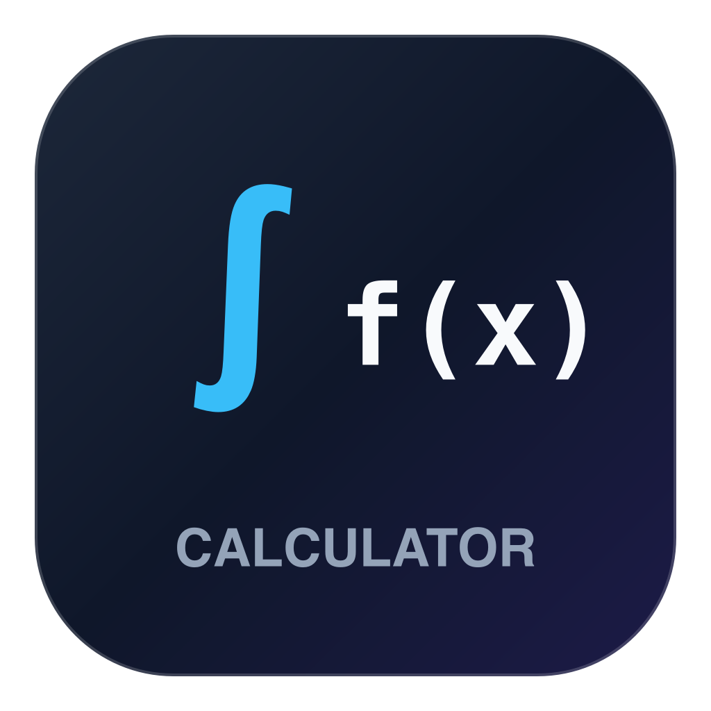
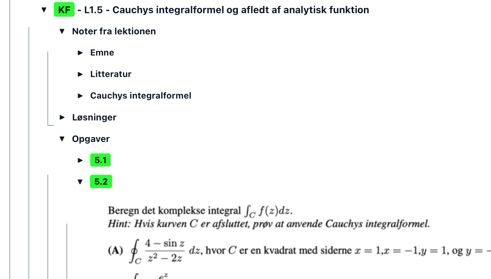
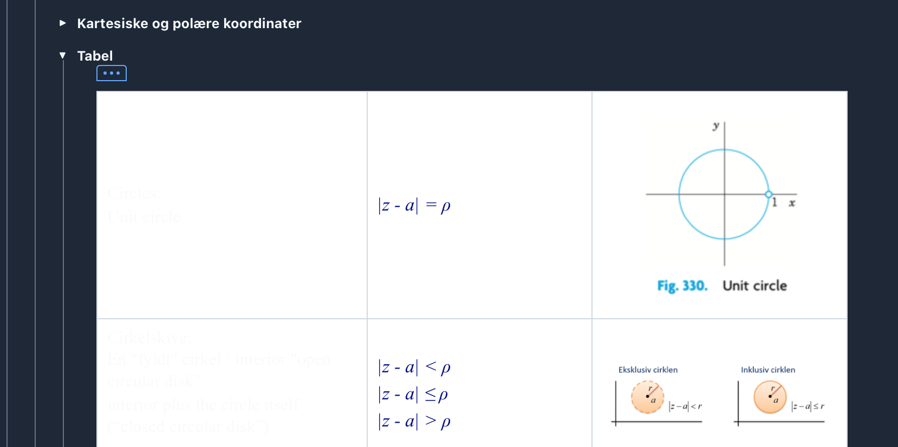

<div align="center">
  

  # OpenMath

  **Interactive Computer Algebra System & Technical Worksheet Environment**

  An open-source interactive computer algebra system (CAS) and technical worksheet environment featuring symbolic computation, typeset mathematical rendering, dynamic plotting, and hierarchical document organization.

  **Developed by [J2KJonas](https://github.com/J2KJonas) and [elomarjc](https://github.com/elomarjc)**

  [](https://j2kjonas.github.io/OpenMath/)
  [](https://github.com/J2KJonas/OpenMath)
  [](https://www.python.org/)
  [](https://riverbankcomputing.com/software/pyqt/)
  [](https://www.sympy.org/)
  [](LICENSE)
</div>

---

## Application Overview

<div align="center">
  
  
</div>

---

## Quick Start

### Web Demo (Browser Preview)

A lightweight client-side preview is hosted on GitHub Pages for zero-install evaluation:

- **Launch Demo**: [OpenMath Web Demo](https://j2kjonas.github.io/OpenMath/)

> [!NOTE]
> **Demo Limitations**: The web application is an in-browser technology preview. For serious computation, full symbolic algebra, and production document export, **use the native desktop application**. The desktop release runs the full Python/SymPy engine with native system performance, high-fidelity vector PDF generation, local file management, and advanced engineering modules.

#### Desktop vs. Web Demo Comparison

| Feature | Desktop Application (Recommended) | Web Demo (Browser) |
| :--- | :--- | :--- |
| **CAS Engine** | Full Python SymPy engine | Client-side JavaScript CAS worker |
| **Performance** | Native multi-threaded execution | Browser JavaScript sandbox |
| **Document Export** | 1:1 Vector PDF with hierarchy brackets | Browser print engine |
| **Document Formats** | Full `.mw` XML, LaTeX (`.tex`), Markdown (`.md`) | Basic `.mw` import / export |
| **Plotting** | High-performance dynamic 2D plotter | Canvas-based plotter |
| **Engineering Math** | Complete bitwise, Q-format, & MCU calculation suite | Core calculus & arithmetic only |
| **Installation** | Local Python environment | None (Instant access in browser) |

---

### Desktop Installation and Launch

OpenMath requires **Python 3.10** or newer.

#### 1. macOS
- **Finder**: Double-click `OpenMath.command`.
- **Terminal**:
  ```bash
  git clone https://github.com/J2KJonas/OpenMath.git
  cd OpenMath
  ./run.sh
  ```

#### 2. Linux (Ubuntu, Debian, Fedora, Arch, Zorin OS)
```bash
git clone https://github.com/J2KJonas/OpenMath.git
cd OpenMath
./run.sh
```
The universal launcher `./run.sh` automatically provisions a local virtual environment (`.venv`), installs all required dependencies from `requirements.txt`, and launches the application.

#### 3. Windows
- Double-click `run.bat`, or run via Command Prompt / PowerShell:
  ```cmd
  git clone https://github.com/J2KJonas/OpenMath.git
  cd OpenMath
  python -m venv .venv
  .venv\Scripts\activate
  pip install -r requirements.txt
  python main.py
  ```

---

## Syntax and Examples

OpenMath supports natural shorthand notation, standard mathematical operations, and SymPy expressions:

### Variables and Functions
```text
f(x) := x^3 - 3*x + 2
g(x) := sin(x) * exp(-x)
a := 15.5
```

### Calculus
```text
diff(sin(x)*cos(x), x)                 # First derivative
diff(x^4 + 2*x^2, x, 2)                # Second derivative
integrate(x^2 * exp(-x), x)            # Indefinite integral
integrate(exp(-x^2), (x, -oo, oo))     # Definite integral (Gaussian)
limit(sin(x)/x, x, 0)                  # Limit as x -> 0
series(exp(x), x, 0, 6)                # Taylor series expansion
```

### Algebra and Equation Solving
```text
solve(x^2 - 5*x + 6 = 0, x)            # Exact quadratic solutions
solve([x + y = 5, 2*x - y = 1], [x, y])# Linear equation systems
factor(x^3 - 3*x^2 + 3*x - 1)          # Polynomial factorization
expand((x + 2)^4)                      # Polynomial expansion
simplify((x^2 - 1)/(x - 1))            # Expression simplification
```

### Linear Algebra
```text
A := [[1, 2], [3, 4]]
det(A)                                 # Determinant
inv(A)                                 # Matrix inverse
eigenvals(A)                           # Eigenvalues
eigenvects(A)                          # Eigenvectors
rref(A)                                # Reduced row echelon form
```

### Embedded Systems and Engineering Math
```text
to_q(3.14159, 16, 8)                   # Convert float to Q8.8 fixed-point
from_q(804, 16, 8)                     # Convert raw Q-format integer to float
ieee754(3.14159, "single")             # 32-bit float sign, exponent, and mantissa
uart_baud(16000000, 115200)            # MCU UART prescaler & baud error analysis
pwm_duty(1024, 75)                     # Timer PWM duty cycle computation
```

---

## Features

### Interactive Worksheet Environment
- **Chronological Execution**: Independent cells executed in sequence with LaTeX equation rendering.
- **Hierarchical Section Folding**: Multi-level nesting (`1. Section`, `1.1 Subsection`) with continuous visual scope brackets and collapsible toggles.
- **Interactive Tables**: Resizable $M \times N$ data grids with theme-aware styling and calculation propagation.
- **Numerical Precision Control**: Per-cell precision configuration (2 to 50 digits) with instant exact-to-decimal toggles.

### Symbolic Computation Engine
- Powered by Python's SymPy library with automatic implicit multiplication (`2x` $\to$ `2*x`), operator parsing (`^` $\to$ `**`), and assignment semantics (`:=`).
- Comprehensive calculus, linear algebra wizard, differential equations, and series approximations.
- Integrated hardware engineering helpers for embedded systems and digital signal calculations.

### Document and Vector Export
- **Vector PDF Export**: 1:1 pagination maintaining exact fonts, hierarchy brackets, math typesetting, and embedded plots without interface chrome.
- **Interchange Formats**: Native `.mw` XML worksheet structure, compilable LaTeX (`.tex`), and Markdown (`.md`).

### Dynamic 2D Plotting
- Cartesian function plots ($y = f(x)$), parametric curves ($x(t), y(t)$), and polar plots ($r = f(\theta)$).
- Automatic singularity and asymptote handling with customizable axis bounds.

### Themes
- Built-in Modern Slate Dark and Academic Light color palettes with instant switching.

---

## Keyboard Shortcuts

| Command | macOS | Windows / Linux |
| :--- | :--- | :--- |
| **Execute Cell** | `Enter` | `Enter` |
| **Execute All Cells** | `Cmd + Shift + Enter` | `Ctrl + Shift + Enter` |
| **Insert Cell Below** | `Alt + Enter` / `Cmd + J` | `Alt + Enter` / `Ctrl + J` |
| **Insert Cell Above** | `Cmd + K` | `Ctrl + K` |
| **Delete Cell** | `Backspace` / `Del` *(outside edit mode)* | `Backspace` / `Del` |
| **Indent Section Level** | `Tab` | `Tab` |
| **Outdent Section Level** | `Shift + Tab` | `Shift + Tab` |
| **Toggle 1-D / 2-D Math Mode** | `F5` | `F5` |
| **Open Matrix Wizard** | `Cmd + M` | `Ctrl + M` |
| **Undo / Redo** | `Cmd + Z` / `Cmd + Shift + Z` | `Ctrl + Z` / `Ctrl + Y` |
| **Save Document** | `Cmd + S` | `Ctrl + S` |
| **Export Vector PDF** | `Cmd + P` | `Ctrl + P` |
| **Zoom View** | `Cmd + +` / `Cmd + -` / `Cmd + 0` | `Ctrl + +` / `Ctrl + -` / `Ctrl + 0` |

---

## Repository Structure

```text
OpenMath/
├── main.py                     # Primary desktop entry point
├── run.sh                      # Universal launcher for macOS and Linux
├── run.bat                     # Windows launcher script
├── OpenMath.command            # macOS double-clickable Finder launcher
├── run_web.py                  # Local development server for WebApp
├── requirements.txt            # Python dependencies
├── index.html                  # Web entry point redirect
├── cas_engine/                 # Core mathematical evaluation engine
│   ├── engine.py               # Stateful SymPy evaluation engine
│   ├── parser.py               # Shorthand math parser and preprocessor
│   ├── formatter.py            # LaTeX typesetter and numerical precision
│   ├── plot_engine.py          # 2D coordinate calculation engine
│   └── embedded.py             # Embedded systems and hardware calculations
├── ui/                         # PyQt6 desktop user interface
│   ├── main_window.py          # Main application window and menus
│   ├── worksheet_view.py       # Worksheet canvas and vector PDF export
│   ├── worksheet_cell.py       # Cell widgets, section trees, and 2D math
│   ├── math_renderer.py        # High-DPI LaTeX renderer
│   ├── matrix_dialog.py        # Interactive matrix creation wizard
│   ├── palette_panel.py        # Mathematical symbol and operator palette
│   └── theme.py                # Academic Light and Modern Slate Dark themes
├── web/                        # Web demo client (hosted on GitHub Pages)
│   ├── index.html              # WebApp interface
│   ├── js/                     # Client application logic and CAS worker
│   └── css/                    # Responsive web styles
├── resources/                  # Icons, fonts, and screenshots
├── scripts/                    # Platform shortcut utilities
└── tests/                      # Automated test suite
```

---

## Testing

Run the automated test suite with Python's standard test runner:

```bash
python3 -m unittest discover -s tests
```

---

## License

This project is licensed under the [MIT License](LICENSE).
